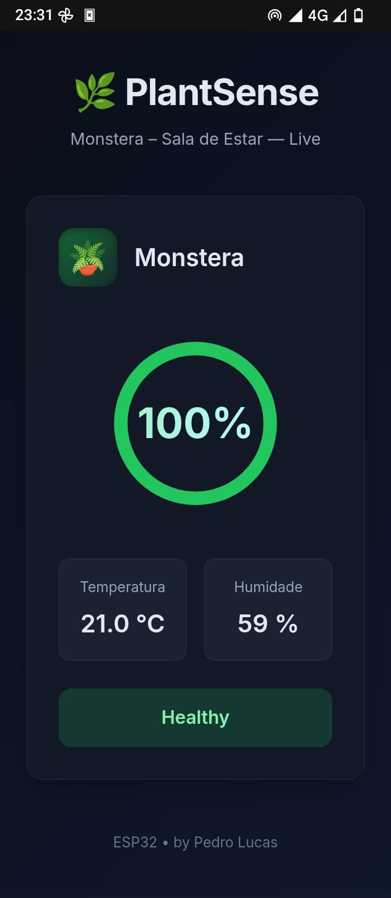
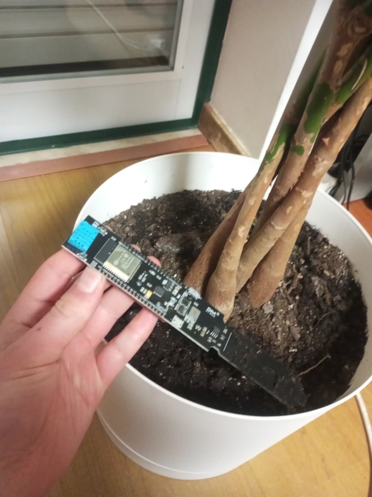

# ESP32 PlantSense 🌿

<p align="center">
  
  
</p>

**ESP32 PlantSense** is a polished, premium-quality plant monitoring system built around an ESP32 microcontroller. Ideal for makers and urban gardeners, it delivers real‑time analytics on soila moisture, air temperature, and humidity through a dark‑mode web dashboard that mirrors the look & feel of modern IoT products. The interface uses a clean color palette and rounded geometry that you can adapt for your own documentation or branding.

_A fully styled dashboard is served directly from the ESP32 over Wi‑Fi (or mDNS at `http://plant.local (In some devices may not work)`)._


## 🚀 Key Features

- **Premium dark‑mode dashboard** with animated gauges, fluid transitions, and a custom typeface (Inter).
- Real‑time monitoring of:
  - Soil moisture (capacitive probe, calibrated in percent)
  - Air temperature and humidity (DHT11)
- Local web access via Wi‑Fi or mDNS (`http://plant.local`) – no cloud required.
- History logging to LittleFS, stored as compact JSON with up to 500 data points.
- Export history as CSV / JSON for offline analysis or backups.
- Visual status badges (Healthy / Moderate / Needs Water) with matching ring colors.
- Lightweight code easily editable in `plantSense.ino`.


## 🛠 SEO Optimized Keywords

`ESP32 plant sensor`, `ESP32 soil moisture monitor`, `ESP32 gardening dashboard`, `DIY plant monitor`, `ESP32 DHT11 project`, `plant moisture sensor with ESP32`, `web dashboard for plants`, `best ESP32 sensor projects`.

## 📁 Project Structure

```
plantSense.ino  – main Arduino sketch
images/        – contains dashboard and sensor photos
README.md      – this documentation
```

## 🧩 Hardware Requirements

- ESP32 development board
- DHT11 temperature & humidity sensor
- Capacitive soil moisture sensor probe
- Jumper wires, breadboard or soldered connections

OR

- ESP32 Plant Sensor (Aliexpress)

## 📡 Software Setup

1. Install Arduino IDE (or PlatformIO) and add the ESP32 board package.
2. Ensure libraries are available: `WiFi`, `WebServer`, `ESPmDNS`, `LittleFS`, `ArduinoJson`, `DHT` (via Library Manager).
3. Open `plantSense.ino` and configure `ssid`/`password` and any pin mappings if needed.
4. Verify and upload the sketch to your ESP32 board.
5. After reboot, connect to the same Wi‑Fi network and browse to `http://<esp32-ip>` or `http://plant.local` to see the premium dashboard.


## 📦 License

This project is open source under the MIT License.

---

**Grow smarter with ESP32 PlantSense!**
